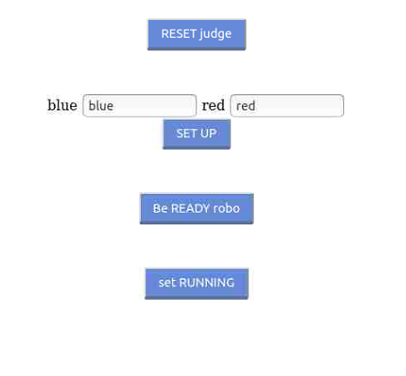

ロボコン本戦運営のスクリプトの解説

# ロボコン本戦運営のスクリプトの解説
https://github.com/p-robotics-hub/burger_colosseum/
以下にあるスクリプトについて、使い方を説明する。

## ファイルの置き場所
上記のレポジトリを下記の場所にCloneする。burger_war_kit, burger_war_devと同じ階層である。

 catkin_ws/src/burger_colosseum

## ロボット関係のスクリプト
robot_scripts の中に入っている。
下記の手順である。
0-1) 審判サーバーの起動
0-2) 審判サーバーのリセット
0-3) パーミッションの変更
1) ロボットの起動
2) ユーザープログラムの起動

### パーミッションの変更
 robot_scripts/fix_permission.sh
(引数無し)

このスクリプトを実行すると、パスワードを要求され、入力すると、パーミッションの問題を解消する。
USBカメラ、LiDAR、OpenCRボードが動くようになる。

このスクリプトは、ロボットPC起動するたびに最初の1度だけ実行する必要がある。
ただし、OpenCRをResetすると実行しなければならない場合がある。

### ロボットの起動
 robot_scripts/burger_startup.sh
- 第1引数) r/b  rならば赤、bならば青
- 第2引数) チーム名(英字) 通常、redもしくはblueと入れている

ロボット起動の前に、OpenCRボードをリセットしたほうが良い。
次に、OpenCRのリセットをする。リセットボタンの位置は、[マニュアルを参照](https://emanual.robotis.com/docs/en/parts/controller/opencr10/#bootloader)。
(JointState、Odometoryの値をリセットするため。Navigationを使っていないソフトウェアは影響を受ける場合がある。)

例
```
./burger_startup.sh r red
```


### ユーザープログラムの起動
- (赤サイド) robot_scripts/match_202103_honsen.sh
- (青サイド) robot_scripts/match_202103_honsen_blue.sh


例
```
./match_202103_honsen.sh
```

このスプリプトは、launch/final_blue.launchもしくはlaunch/final_red.launchを起動し、
審判サーバーをスタートしている。

### ロボットを止める。
まず、ユーザープログラムをCtrl+cで停止させる。
burger_startup.shを停止してはいけない。

その後、
```
robot_scripts/stoprobot.sh
```
を起動すると/cmd_velに停止指令が送られる。


### トラブルシューティング
- 動かない
まず、ロボット起動のスクリプト`burger_startup.sh`をCtrl+cで停止させる。

次に、OpenCRのリセットをする。リセットボタンの位置は、[マニュアルを参照](https://emanual.robotis.com/docs/en/parts/controller/opencr10/#bootloader)。
リセットボタンで直らない場合、USBケーブルを抜き差しする。
その場合、パーミッションの修正（上記）が必要。

その後、再び、ロボットを起動する。(burger_startup.sh)


## ジャッジサーバー起動
judge_scripts/judge_start.sh
(引数無し)

以下の動作を行う
1. ジャッジサーバーが起動 ( gnome-terminal )
2. ジャッジウインドウが起動
3. Firefoxが起動し、http://192.168.0.100:5000 へアクセス



1. RESET judge
2. SET UP
3. Be READY robo
の順番にクリックし、サーバーをReady状態にしておく

## Dockerを使った運用
以下は、Dockerを使った本戦運用のスクリプトである。

### (Docker用)参加者のレポジトリをCloneする
burger_colosseum/ws_scripts/clone_ws_robo.sh
- (第1引数) レポジトリ名 例: p-robotics-hub

このスクリプトの使用には、`~/catkin_ws_robo/src/*`に、リファレンスとなる
`burger_war_dev`、`burger_war_kit`および`burger_colosseum`を入れておく必要がある。


使用例
```
./clone_ws_robo.sh p-robotics-hub
```

まず最初に、下記を実行してホームディレクトリにこのスクリプトのシンボリックリンクを作っておく。
```
ln -s ~/catkin_ws_robo/src/burger_colosseum/ws_scripts/clone_ws_robo.sh ~/
```

以下の動作をする。
1. ホームディレクトリに、というように、`catkin_ws_{レポジトリ名}/src`のディレクトリをつくる。例: 
`~/catkin_ws_p-robotics-hub`
2. レポジトリをcloneする
3. `burger_war_kit`, `burger_colosseum`)をcatkin_ws_roboからコピーする
4. `burger_war_dev/docker/robo`をcatkin_ws_roboからコピーする
5. `burger_war_dev/commands/*`をcatkin_ws_roboからコピーする
6. `burger_war_dev/commands/config.sh`をレポジトリ名に書き換える
	
	
スクリプトの最後に次に入るべきディレクトリが指示されている。

上で作られた`catkin_ws_{レポジトリ名}/src`の中の`burger_colosseum/docker_robot_scripts`のスクリプトを使う。

### (Docker用)コンテナのビルド
docker_robot_scripts/build_container_robo.sh
(引数無し)

コンテナをビルドする。ライブラリの追加が無ければすぐに完了する。

必要なライブラリは、`burger_war_dev/docker/core/Dockerfile`
に記述する。

### (Docker用)コンテナをランチする
docker_robot_scripts/launch_docker_robo.sh
(引数無し)

起動すると設問があるので、赤側(r)か青側(b)かを選ぶ。
コンテナが起動し、ロボットがbring_upする。

### (Docker用)ロボットをスタートする
docker_robot_scripts/start_robo.sh
(引数無し)
起動すると設問があるので、赤側(r)か青側(b)かを選ぶ。
ユーザープログラムが動き出す。

### (Docker用)ロボットを停止する
まず、`Ctrl+c`でユーザープログラムを停止する。

そのままでは、最後の速度指令のまま動き続けてしまうので、

docker_robot_scripts/start_robo.sh
(引数無し)

を実行してロボットを止める。

### (Docker用)コンテナの中に入ってメンテナンスする
docker_robot_scripts/enter_container.sh
(引数無し)

コンテナの中に入ってメンテナンスができる。`apt`や`pip`、`rosdep`なども使える。
`apt`を使う場合まず`sudo apt update`を行う必要がある。
`rosdep`を使う場合、`catkin build`を行って後でないといけない。
